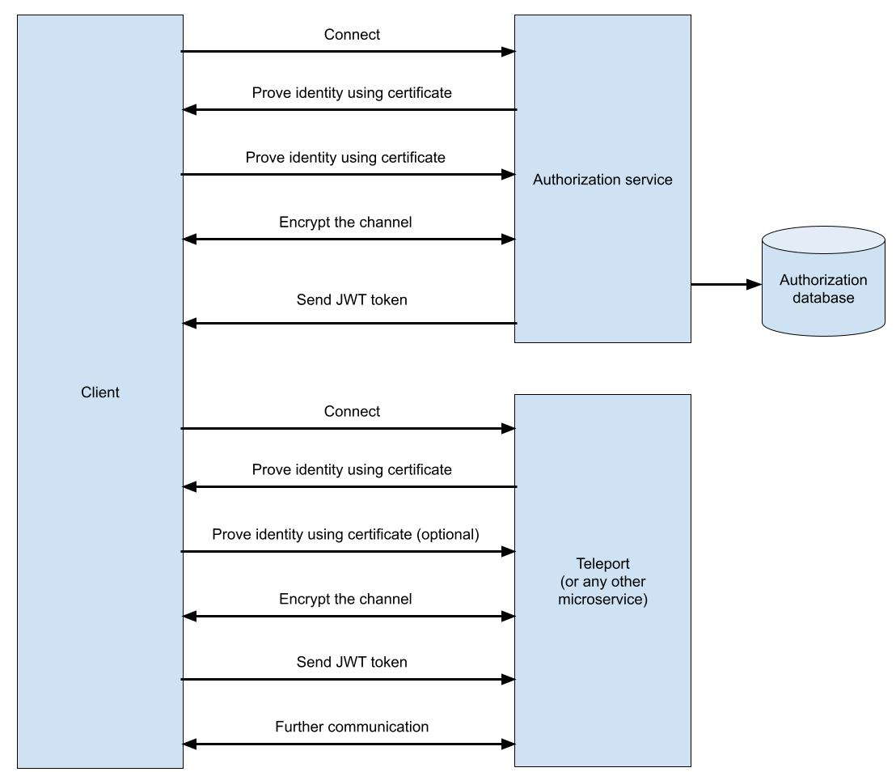
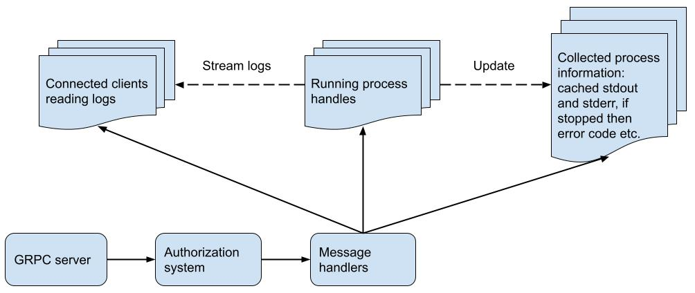

# Protocol design

## Protocol format

While JSON remains the most popular format for exchanging messages in the modern Internet, it is not without issues. Rust as a language was designed to be high-performing but JSON adds relatively high overhead for parsing messages. For low level and high-performing applications binary protocols are more suitable.

The most popular binary message format at the moment is Google [Protobuf](https://developers.google.com/protocol-buffers). It is commonly used together with the [gRPC](https://grpc.io/) protocol that is an efficient replacement for REST API.

## Communication design

There are five operations that the client may perform:

- Start a task.
- Stop the task.
- Check the task status.
- Stream the logs (stderr and stdout).
- List pending tasks.

Those five operations can be directly mapped to five API methods:

- **Start** - starts the task. Returns one of:
  - Started task information (for example task ID that is necessary for other API calls)
  - Error in case the task could not be started.
- **Stop** - stops the given task. Returns finished process information.
- **Status** - obtains information about the given tasks. Returns one of:
  - Finished process information
  - Running process information.
- **Logs** - stream of string representing pieces of stdout or stderr. Once the client connects it first receives cached output of the given task, then a live stream generated by the process. This means that the output of the given task will be stored in the server.
- **List** - lists all pending tasks.

The precise message and API specification can be found [here](../proto/teleport.proto).

# Authorization

## Authorization mechanism

Normally in the microservice architecture there is a specialized authorization service that has a database with information about users and their permissions. In a naive implemention services such as teleport would ask the authorization service if the given user has the right to perform the given operation. This approach is unfortunately not scallable. It requires making a request to the authorization service every time a request is processed by the teleport service. Eventually this leads to a denial of service when the authorization service or its database is flooded with too many requests.

A better mechanism is to use authorization tokens for example the JSON Web Tokens. In this schema the client asks the authorization service for a security token that is valid for some period of time (usually an hour). Durign this period no further requests to the authorization service need to be made.

The communication procedure looks like this:

1. Client connects to the authorization service.
2. Authorization prooves its identity using a certificate.
3. Client prooves its identity using a certificate. This and the previus step are implemented using TLS.
4. The channel becomes encrypted.
5. Authorization service check in the database what permissions are assigned to the client.
6. Authorization servcie generates a secret signed token and sends it to the client thrugh the encrypted channel (the key is secret)
7. Having the token client can perform requests to all services for the next one hour.
8. Client connects to the given microservice.
9. Identity check are again performed using TLS. Client certificate is optional - depending on the implementation client identity can be encoded in the token.
10. Channel becomes encrypted.
11. Client sends its token.
12. Server check if the token is correctly signed and uses its information for authorization.
13. Assuming that the token is correct and the client has the right permissions, client request is executed.

## Simplification

Writing an authorization service is out of scope for this project. Behavior of the authorization service will be simulated in the client.

## Authorization permissions

The authorization permissions schema for this application is very simple. Users can have five assigned permissions that correspond to the five API methods:

- Start task
- Logs
- Stop
- Status
- List tasks

It is assumed that the user can perform those operations on all tasks - both started by the given user or started by somebody else. In a production-ready system users would be limited to perform those tasks only on tasks started by them or started by users belonging to the same group. But user and group management is out of scope for this challenge.

# Application design

## Client

Client is a simple command line application with five subcommands. On receiving responses the client prints logs on the screen or prints relevant information on the screen.

## Server

Server is an asynchronous application with a gRPC server, authorization system, several message handlers and three collections:

- Running processes
- Information about finished processes
- Connected clients reading logs

In production the information about finished processes would be kept only for a period of time to avoid reaching resource limits and possibly would be saved to an external file/database to save RAM, but in this simple challenge only internal RAM-based collection are used.

# Resource limits

There are three kinds of limits that the server should impose on tasks:

- CPU
- Memory
- Disk

## CPU

Tthere are at least three ways how CPU usage can be limited:

- Total maximal CPU runtime can be configured using the setrlimit() Linux function (https://linux.die.net/man/2/setrlimit) or alternatively setrlimit64() for higher ranges. This approach limits total CPU runtime but not includes the time when the process is running but doing nothing, for example the `sleep` command.
- Limiting CPU cores available to the process by using the sched_setaffinity() function (https://man7.org/linux/man-pages/man2/sched_setaffinity.2.html).
- cgroups (https://man7.org/linux/man-pages/man7/cgroups.7.html) can be used to flexibly limit maximum CPU usage at the given moment.

Because limiting resources is not the key feature of this application, the first option (setrlimit()) is used.

## Memory

Memory - memory can be easily limited using the setrlimit() function.

## Disk

Linux qute surprisingly does not provide any good disk management mechanisms. There are three possiblities:

- Throotling can be implemented using cgroups.
- Process quotas are not supported but can be emulated using user quotas. In this approach a new user needs to be created for every task.
- Limiting single output file size can be easily achieved using setrlimit() function. This still not stop the application from creating millions of small files.

Because the first two solutions are quite complicated, the third is implemented.

# Tests

The project uses two kinds of tests:

- Unit tests - written in the Rust language.
- API tests of the server. While the server is written in a high performance language and uses asynchronous dispatching to optimize resource usage, there is no need for this in tests. To shorten development and make tests more managable, the tests are written in the Python 3 language.

# Build system

Rust already has a default build system called cargo. However, to make the builds fully reproducible a complete environment is needed and a Dockerfile needs to be created. It consists of three stages:

1. Rust container designed to have a reproducible client and server builds together with unit tests.
2. Python 3 container designed to perform the API tests.
3. Final container designed to be small but able to run client and server applications.

# Libraries and tools

Rust crates:

- `tonic` - the only production-ready GRPC Rust crate
  tokio - asynchronous event dispatcher
- `tokio::process` - asynchronous process management
- `clap` - command line argument parser for the client
- `jsonwebtoken` - for creation and validation of JWT tokens
- `serde` - JSON and configuration deserialization

Tests:

- `Python 3`
- `pytest` - the most popular Python 3 test executor
- `grpc` python package - GRPC functionality
- `stress` application - for resource limit tests, it is designed to simulate high resource usage

Other

- Build system: `cargo`, `Docker`
